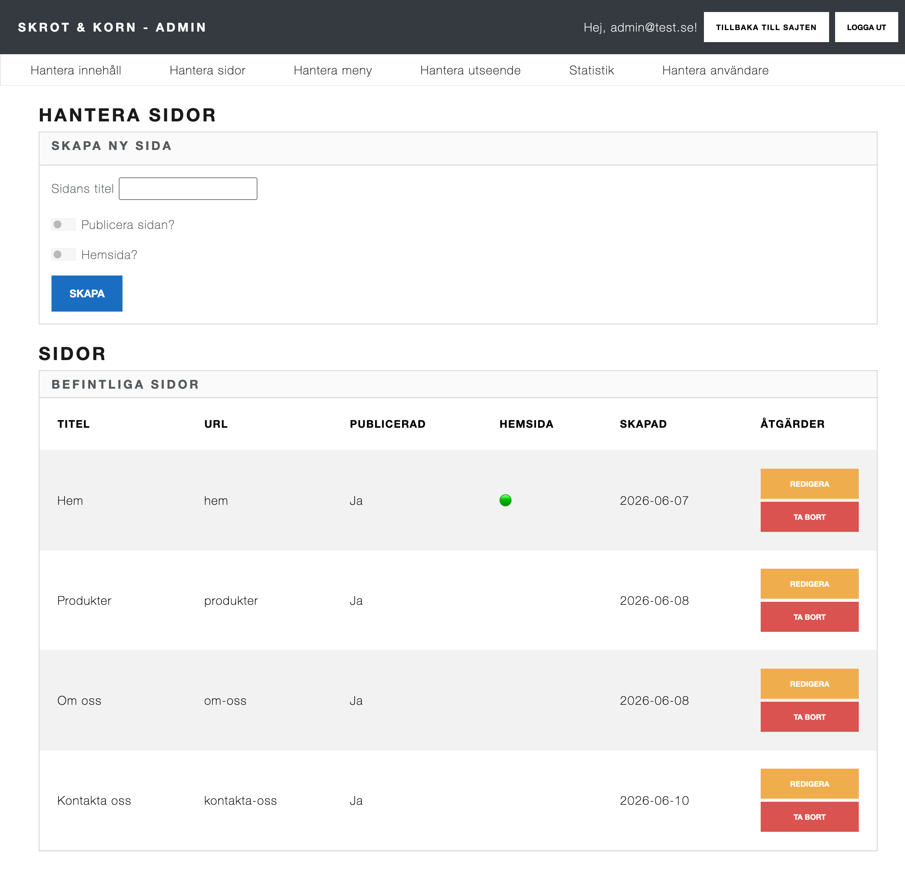

# Public CMS

A custom Content Management System built as a school project to demonstrate clean architecture principles in a full-stack .NET application.

**Live demo:** https://anton-public-ui.azurewebsites.net/

## ✨ Overview

Administrators can manage pages, menus, content blocks and image uploads through an admin interface. Public pages are generated dynamically from the database, with content blocks placed in different sections (main, sidebar, footer).

## 📸 Screenshots

**Public site**


**Admin — page management**



## 🏛 Architecture

The solution follows **Onion Architecture** with four projects:

- **Public.Domain** — Entities (`Page`, `ContentBlock`, `MenuItem`, `Visit`, `AppUser`) and repository interfaces
- **Public.Application** — Services, DTOs and business logic
- **Public.Infrastructure** — EF Core `DbContext` and repository implementations
- **Public.API** — REST API controllers (Pages, ContentBlocks, MenuItems, Visits, Upload)
- **Public.UI** — Blazor Server frontend, fully decoupled from the backend and communicating only via HTTP

The UI has no project references to Application or Infrastructure — all data flows through the REST API using `HttpClient` and its own UI models.

## 🛠 Tech Stack

- **Framework:** ASP.NET Core 10
- **Language:** C#
- **Frontend:** Blazor Server
- **Backend:** ASP.NET Core Web API (REST)
- **ORM:** Entity Framework Core
- **Database:** Azure SQL Server
- **Auth:** ASP.NET Core Identity
- **Styling:** Bootstrap
- **Docs:** Swagger

## 🎯 Features

- CRUD for pages, content blocks and menu items
- Section-based content blocks (main / sidebar / footer)
- Image upload to `wwwroot/uploads/`
- Automatic URL slug generation from page titles
- Dynamic public pages rendered from database content
- Dynamic navigation generated from the menu
- Login / logout via ASP.NET Core Identity
- Visitor counter

## 🚀 Getting Started

### Requirements

- .NET 10 SDK
- SQL Server (local or Azure)

### Run

```bash
# Start the API (port 5189)
dotnet run --project Public.API

# Start the Blazor UI in a separate terminal
dotnet run --project Public.UI
```

The UI is configured to call the API at `http://localhost:5189`.

### Database

Update the connection string in `Public.API/appsettings.json` and apply migrations:

```bash
dotnet ef database update --project Public.Infrastructure --startup-project Public.API
```

## 📁 Project Structure

```
Public/
├── Public.Domain/         # Entities and interfaces
├── Public.Application/    # Services and DTOs
├── Public.Infrastructure/ # EF Core, repositories
├── Public.API/            # REST API
└── Public.UI/             # Blazor Server frontend
```
